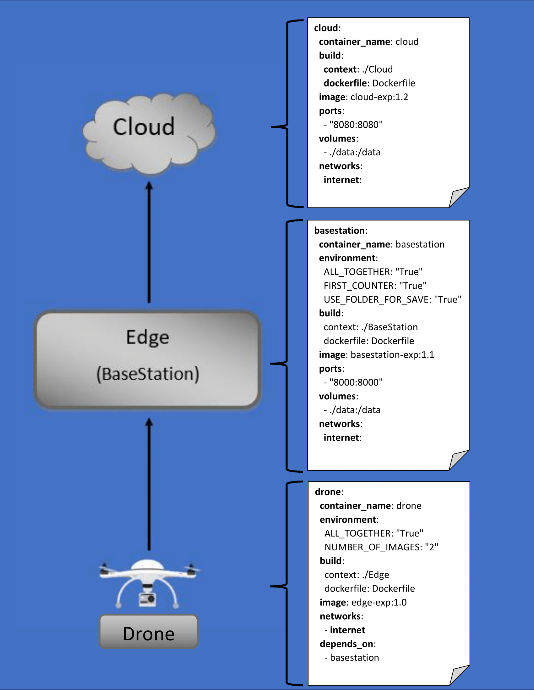

# Description

This repository provides a 3-tier application for counting vehicles on roads. The drones, which are implemented as lightweight containers, capture the necessary images from the roads and send them to the base station. The base station processes the images locally before sending them to the cloud for further processing or storage. The base station server could be considered the edge in this context. Finally, the cloud server receives a dictionary with the number of vehicles in each image so that it can theoretically update cars heading to these roads.

## Requirements

Before starting, we have to install docker, docker-compose, and docker swarm on the infrastructure. For more information, we suggest the official documentation.

# Components

The application follows a micro-service approach with three services, drones, an Edge server (BaseStation), and a Cloud server. The following image highlights the service yaml docker-compose representation of the application.

  

## Drone

The Drone capture images from the road and sends that images via HTTP Post Request to a specific Edge server (BaseStation). Users have to define environmental variables, including ALL_TOGETHER, which defines if the images will go in one request or splitted in more, NUMBER_OF_IMAGES, which is the number of images to go if the first variable is False and so the images will go in separated segments (different requests: Total number of images divided by the variable's number)

## Edge Server (BaseStation)

The Edge server receives the images neither all neither in segments via an HTTP API call and counts each vehicle that represented in each images via two functions, and creates an dictionary to be send to cloud. Users have to define environmental variables, including ALL_TOGETHER, to know how the server how to receive images, FIRST_COUNTER, to declare which of two functions to use to count vehicles, and USE_FOLDER_FOR_SAVE, to know if the server will use a temporary folder to save images during the process. Server running FastAPI framework.

## Cloud Server

Cloud server retrieves the aggregated data from the Edge device after the Edge Server send them with a HTTP Post Request. Cloud prints the dictionary and response to Edge that is everything ok. Theoretically Cloud must inform drivers about the specific roads and the traffic in that moment.

# Build Application Components

In order for users to build the containers of the application, and also to build their images, they need to execute the docker compose command ONLY, because everything is set up in the docker-compose.yaml in the root of project.

# Run the application via Docker-compose

we need the --build for the build of container's image

`docker-compose up --build`

## License
[MIT](https://choosealicense.com/licenses/mit/)
